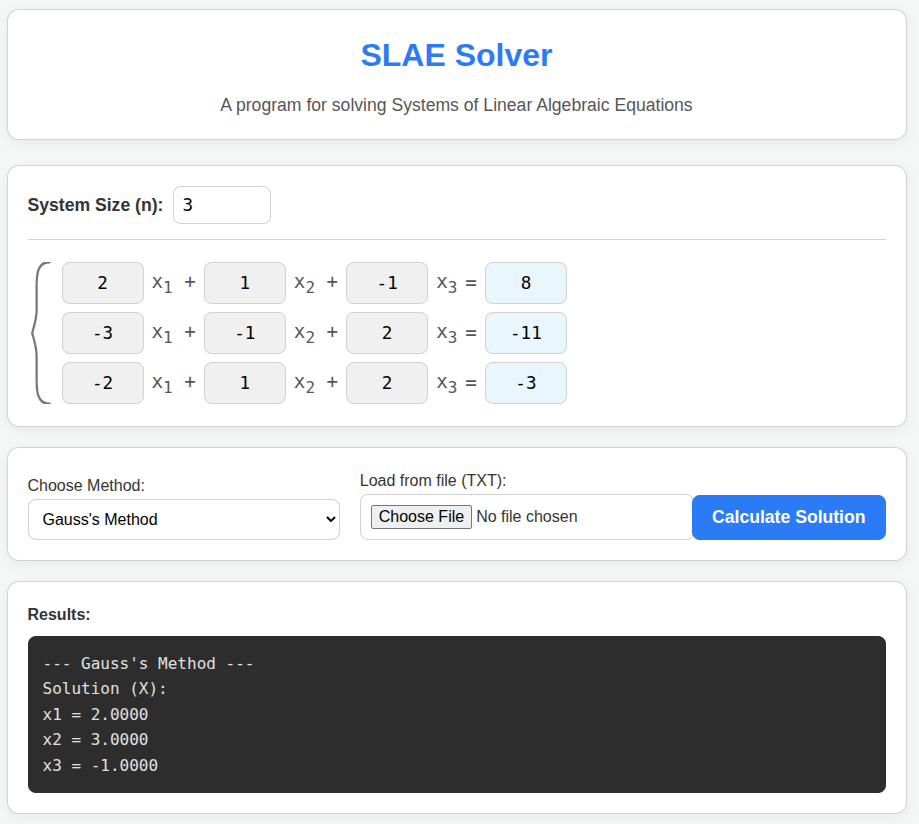

# SLAE Solver (React + TypeScript)
A small web app for solving **Systems of Linear Algebraic Equations (SLAE)** using classic numerical methods.


## Features
- Choose a solving method:
  - Gauss (partial pivoting)
  - Gauss–Jordan (partial pivoting)
  - Cramer's method *(recommended only for n ≤ 4)*
  - Jacobi *(iterative)*
  - Seidel / Gauss–Seidel *(iterative)*
- Edit matrix **A** and vector **B** in a grid input.
- Arrow-key navigation inside the grid.
- Load system from a `.txt` file.
- Prints the solution vector **X** and validates it (checks `A·X ≈ B`).

## Input formats

### Manual input
Fill the grid for matrix **A** and vector **B**.

### File input
Text file format:
- Line 1: `n`
- Next `n` lines: `n+1` numbers per line (augmented matrix `[A | B]`)
Example (`n = 3`):
```3
2 1 -1 8
-3 -1 2 -11
-2 1 2 -3
```
## Notes / Limitations
- `n` is limited in the UI (max 12).
- Jacobi / Seidel may not converge if the matrix is not diagonally dominant (the app warns and may fail).
- Cramer's method is restricted to small systems (n > 4 throws an error).

## Tech Stack
- React 19 + TypeScript
- Vite

## Run locally
```bash
npm install
npm run dev
```

## Build
```bash
npm run build
npm run preview
```